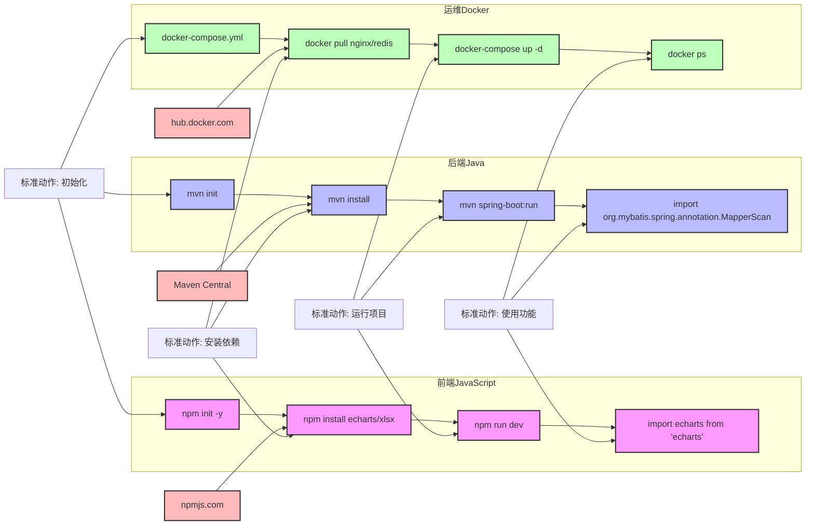

# 欢迎,欢迎

hello,我是landa,一个前端开发者,这个博客是我在前端工作中经历的一些思考,难题和沉淀下来的思考,可能并不全是讲前端的内容.
也会分享一些对我观念和成长轨迹改变较大的一些书和观点.所以这篇文章不讲技术,咱们聊一些虚虚的东东~

## 我认为技术人的核心素养
<!-- * 走向管理 以一当百 -->
<!-- * 复合型技术人才(全栈也好,AI工程师也好,都是解决问题的能力强) -->
* **不设上限:** 永远不给自己设限,面向自我成长编程
* **了解工具:** 编程语言是一门工具,时刻理解你手上工具的局限性和应用范围
* **迁移学习:** 技术之间可以迁移,因为标准动作有太多的相通性
* **审美能力:** 技术决定下限,审美是决定了你未来出品的上限的(写代码,剪视频,产出类都是这样)

### 1. 永远不给自己设限,面向自我成长编程

> 没有人天生是前端开发,也没有人天生是后端研发,这个称谓只是代表你在市场经济中所被需要的技能统称,我在职场中遇到很多运维是后端转的,很多前端是UI设计转的,很多解决方案岗位是项目经理转的.

这些都是不同的岗位,不同岗位的要求他们就能瞬间满足吗? 不一定, 所以就靠平时的日积月累或者刻意练习. 

譬如我们有一个项目是工厂车间要做出能源流动的效果客户要求要立体感交互感,当时我们设计师还是平面UI,并不会3D设计,那最后项目怎么上线的呢? 

公司并没有花钱专门请一个3D设计师来建模,就是我和设计每天抽空1-2个小时相互分享自学`blender`然后打包`gltf`,集成`Three.js`完成的,虽然看起来粗糙但是从0到1了,并且客户满意,这个项目作为二期其中一个核心功能加价几十个W买了.

做一件事情,如果是正其心,诚其意,愿意通过学习新技能武装自己,就能收获不一样的技能和巨大的满足感,而不是遵从公司给你定义的title,我称之为接受市场化,是一种自我突破的行为.相信我你只要做到一次就能明白不设限对自己的好处.

### 2. 编程语言是一门工具,时刻理解你手上工具的局限性和应用范围

> 就像你掌握了批判性思维,你会在面对问题时能够有目的性的思考,而不是盲目的去解决问题.譬如你用经济学思维去权衡利弊做选择,这都是解决某种类型问题的锤子,大脑的惯性会让你锤子舞的好的时候下意识去找钉子,你逐渐享受将钉子钉进木头的那种满足感,这个逻辑和`标准动作`有一定冲突,但我想讲的是:
1. 别被工具所局限
2. 认清工具能做的事情(刮胡刀修不了飞机,高射炮打不了蚊子) 套用在语言选择上,就是python, java, go等,套用在数据库上就是:关系型和非关系型各自解决各自擅长的问题. 

### 3. 技术之间可以迁移,因为标准动作有太多的相通性

> 技术是工具,工具有相通之处,你掌握一种,当你看到另外一套东西时你曾经练习过的`标准动作`依然适用.

举个例子,`前端`启动项目一般是初始化:`npm init -y`安装: `npm install XXXX` 启动 `npm run dev`, 你可以将这个动作看作是一个标准动作, 你在其他项目中也可以使用这个动作, 只是参数不同.参数就是安装三方库的XXXX,现在你看到的是四个X,在你想用图表的时候你替换成 `echarts` 你想用excel解析的时就用`xlsx`.

那我们再来看一个例子,`后端`启动项目一般是初始化:`mvn init`安装: `mvn install` 启动 `mvn spring-boot:run`, 你可以将这个动作看作是一个标准动作, 去寻找解决你当下问题的`XXXX`,在你想用图表的时候你替换成 `mybatis` 你想用excel解析的时就用`poi`.

好的,你现在是运维,docker 拉取项目:`docker pull datart/datart`安装: `docker-compose up -d` 启动 `docker run -d --name datart`, 你可以将这个动作看作是一个标准动作, 因为你知道有一个你需要的库/包/容器,别人已经写好了,你无非是从想办法拿到他,使用他,解决你当下的问题.是不是觉得很简单? 

### 4. 技术决定下限,审美是决定了你未来出品的上限的

> 为什么这么说? 我在工作中遇到太多程序员,他们解决问题的思路各不相同,做出的结果也千差万别,但他们都有一个共同的特点,就是他们都有一个共同的上限,就是他们的审美能力.

我这里不是指样式上的审美,而是你对一个事物的理解,有没有达到一个境界,达到这个境界你就能做出更好的产品,而不是简单的按照标准动作去做.

就像你想做穿搭博主,你可能需要大量看不同的穿搭,不同的样式,不同的颜色,不同的素材,不同的组合,才能达到你想要的效果.

写好一个功能前,你如果没有见过优秀的设计是什么样的,你的心中没有标准,或者标准只能满足自己,在做出东西后的使用和推广上是有一定的困难的.

就拿企业来说,服务于企业内部的toB系统之所以可以不用扣细节很多后端同事也能做,就是因为这个事情他不用考虑上限,有技术实现的下限就够.

但如果你做toC产品,你甚至一个动画的速度要调整N版本,这样锤炼出来的产品是被大众所接受的,也逐渐在你自己心中竖起一个审美的标准,如果你将这个标准应用在日常产出中,用在你对自己交付物的把控中,就是和其他程序员分隔开的一个非常大的差距.

## 技术标准动作的相通性

不同技术领域虽然工具和语言不同，但它们的标准动作和工作流程却有着惊人的相似性。这种相似性使得开发者在学习新技术时能够更快地适应和掌握。当你理解了一个技术领域的基本工作流程后，你会发现这些模式在其他领域也同样适用，只是具体的命令和工具有所不同。

以包管理和依赖安装为例，前端、后端和运维领域都有各自的包管理器和仓库源，但它们的使用逻辑和流程是相通的：查找资源、下载依赖、安装配置、使用功能。这种标准动作的相似性大大降低了技术学习的门槛，让技术迁移变得更加容易。

下面这张图展示了前端JavaScript、后端Java和运维Docker三个不同领域的包管理和依赖安装流程的相似性：

从上图可以看出，尽管前端JavaScript、后端Java和运维Docker使用的具体工具和命令不同，但它们都遵循相似的工作流程：初始化项目、安装依赖、运行项目和使用功能。这种标准动作的相通性是技术学习和迁移的关键。

当你掌握了这些标准动作后，无论面对什么新技术，你都能够快速找到对应的操作方式，大大降低学习成本。这也是为什么有经验的开发者能够快速上手新技术的原因之一。

## 最后
不设上限,善用工具,技术迁移,审美能力这几点我已经尝试在内化成习惯,但在各种实践中还是会有不一样的感受,如果这篇文章能对你有一小点启发,那我就很荣幸.帮我右上角github点个小星星~ 嘿嘿嘿
[Sunlanda's Blog](https://github.com/sunlanda/blog)