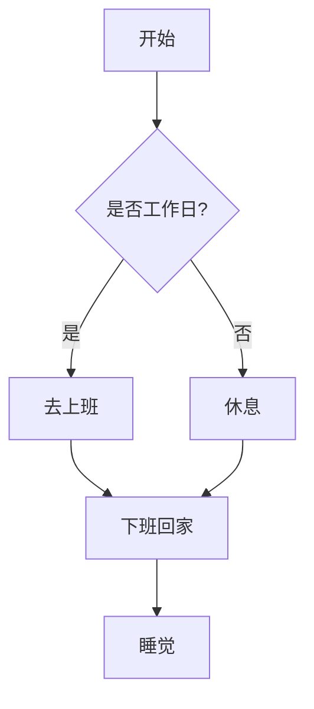
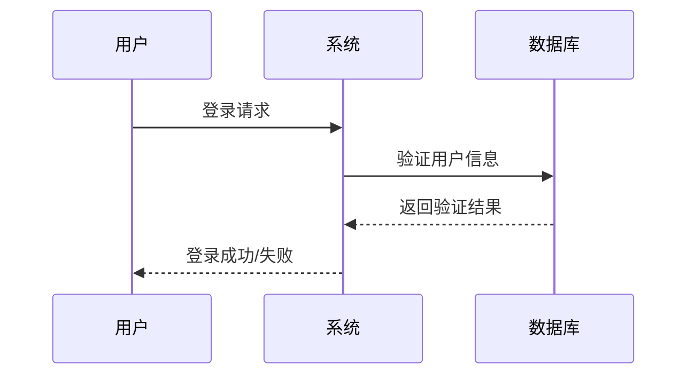
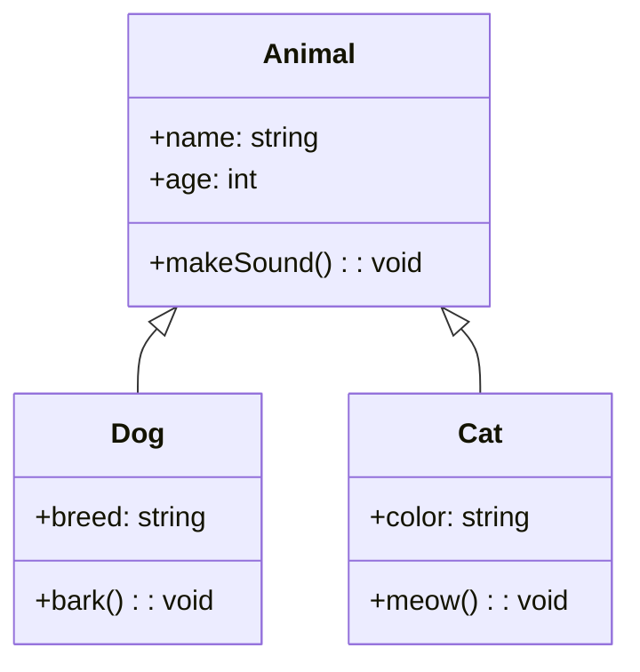

# Mermaid 测试页面

这是一个测试 Mermaid 图表渲染的页面。

## 流程图示例

```mermaid
graph TD
    A[开始] --> B{是否工作日?}
    B -->|是| C[去上班]
    B -->|否| D[休息]
    C --> E[下班回家]
    D --> E
    E --> F[睡觉]
```

## 时序图示例

```mermaid
sequenceDiagram
    participant 用户
    participant 系统
    participant 数据库
    
    用户->>系统: 登录请求
    系统->>数据库: 验证用户信息
    数据库-->>系统: 返回验证结果
    系统-->>用户: 登录成功/失败
```

## 类图示例

```mermaid
classDiagram
    class Animal {
        +name: string
        +age: int
        +makeSound(): void
    }
    class Dog {
        +breed: string
        +bark(): void
    }
    class Cat {
        +color: string
        +meow(): void
    }
    Animal <|-- Dog
    Animal <|-- Cat
```