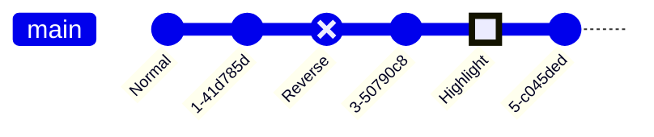

# 如何使用代码绘制UML架构图

```mermaid-example
    gitGraph
       commit id: "Normal"
       commit
       commit id: "Reverse" type: REVERSE
       commit
       commit id: "Highlight" type: HIGHLIGHT
       commit
```

## 参考
* 官网 https://mermaid.js.org/
* 文档 https://mermaid.js.org/syntax/gitgraph.html
* [交互演练场: ](https://www.mermaidchart.com/play)